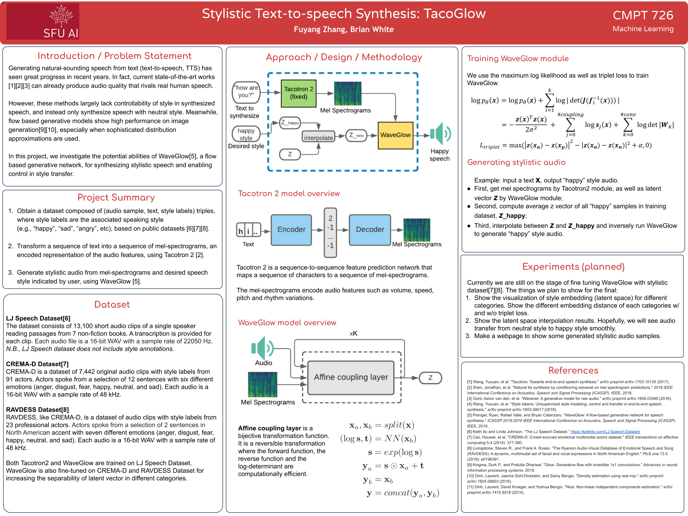

# TTS-Style-Transfer
CMPT726 Final Project. Fuyang Zhang(fuyangz@sfu.ca), Brian White(bjw10@sfu.ca)

## Overview
Please see [report.pdf](726_tts_report.pdf) for detailed implementation.



## Audio samples
https://zhangfuyang.github.io/TTS/

## Dowload
1. **Download a dataset:**

   Download the following dataset. 
    * [LJ Speech](https://keithito.com/LJ-Speech-Dataset/)
    * [crema-d](https://github.com/CheyneyComputerScience/CREMA-D)
    * [ravdess](https://smartlaboratory.org/ravdess/)

   We use the LJ Speech dataset for both Tacotron2 module and Waveglow module. Next, we fine-tune waveglow module with crema-d and ravdess datasets. 

   You should create a 'data' folder and link three datasets in it.
2. **Download pretrained model:**

   Download pretrained model from [here](https://drive.google.com/file/d/18cMWPgZG0YqENA63Y7Xzr3RW19vBpUyS/view?usp=sharing).

## Train
1. **Train a model**

   ```
   python train.py -c config.json
   ```

## Test
1. **Get style vector**

   ```
   python get_vector_for_style.py -S <style name> -o ./
   ```

2. **Style transfer**

   ```
   python style_transfer.py -S <style name> -w <orignal wav> -o ./
   ```

## Contact
If you have any questions, please contact us at fuyangz@sfu.ca, bjw10@sfu.ca
